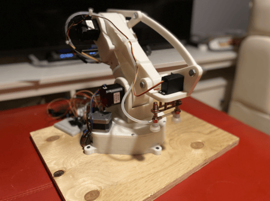

# Solidworks-Controlled-Stacking-Robot
This project extracts pick-up and drop-off coordinates from two SolidWorks Assembly files: one showing the robot’s starting environment and one showing the final stacked layout. Macros created using the SolidWorks API extract the coordinates and generate a temporary PowerShell script. The script sends the coordinates to the computer port connected to the robot’s Arduino, which moves the robot accordingly. 
(More below)
## Robot Info

- **Gearboxes**: Three custom-designed 1:20 cycloidal gearboxes that provide high torque and compact form factor
- **Payload Capacity**: Can lift and move objects up to 3kg within a 40cm radius using a vacuum suction mechanism for reliable pick-and-place operations
- **Kinematics**: Uses coordinate system and inverse kinematics to calculate joint angles for reaching target positions

**CAD Link**: (https://grabcad.com/library/solidworks-controlled-stacking-robot-1)

## Demo Video

Watch the robot in action:  

